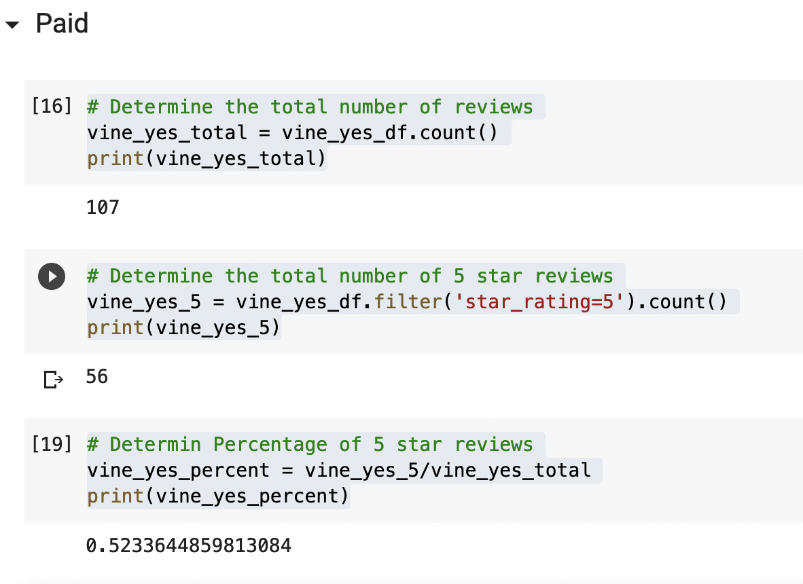
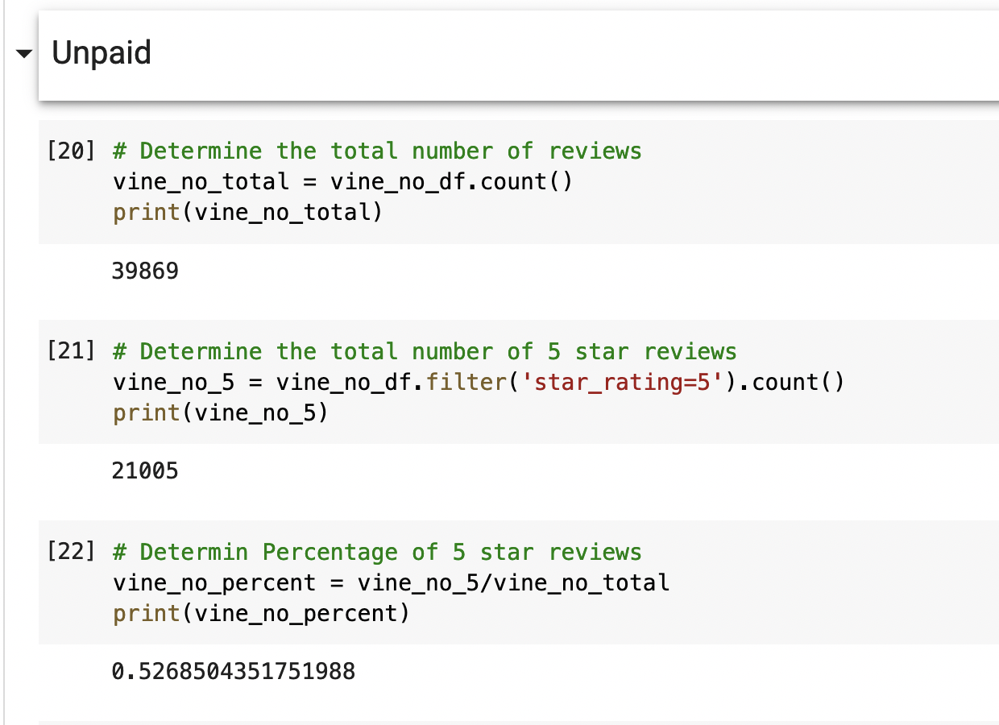

# Amazon Vine Analysis

## Overiew of the Analysis
### Purpose
The purpose of this prjoect was to analyze Amazon reviews written by members of the paid Amazon Vine program. Amazon Vine program is a service that allows companies to provide products to Amazon Vine members, who are then required to publish a review. This project specifically looked at reviews for products in the Outdoor category. The data was pulled from amazon, transformed in Google Collab using PySpark and then loaded into a Postgres database for further analysis.

## Results
### Vine Reviews
- There were a total of 107 vine reviews with 20 or more helpful votes
- Of the 107 reviews, 56 were 5 Star reviews
- 52.33% of the reviews had 5 stars

### Non-Vine Reviews
- There were a total of 39869 non-vine reviews with 20 or more helpful votes
- Of the 39869 reviews, 21005 were 5 Star reviews
- 52.69% of the reviews had 5 stars

## Summary
Based on this limited analysis there does not appear to be a bias for products received through the Vine program. In fact, the free vine products actually had a slightly lower percentage of 5 star reviews by .36%. However, without further analysis it is not possible to declare these findings statistically significant. Below, I have outlined a few other analyses that might provide more insight. 

### Further Analysis
1. The first analysis I would run would be to test the findings and sample size to see if it is statistically significant.
2. I would also run the analysis on other product categories to see if there is any difference between the categories.
3. Getting the average rating would also provide more insight to see if Vine products got higher ratings on average rather than only looking at 5 star reviews.
